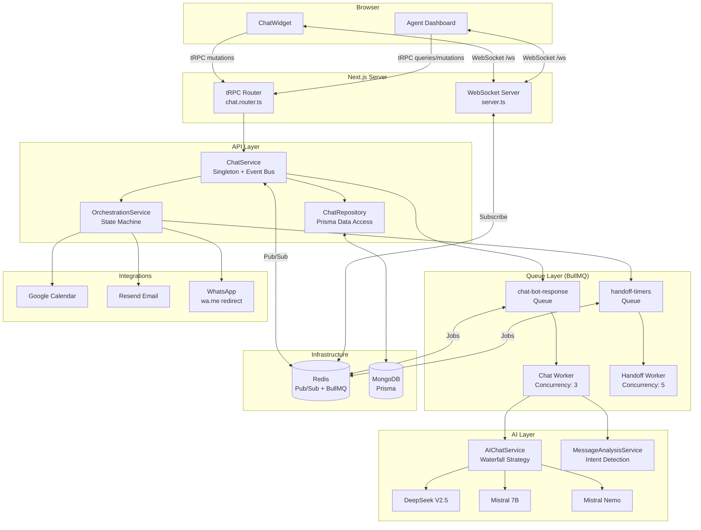
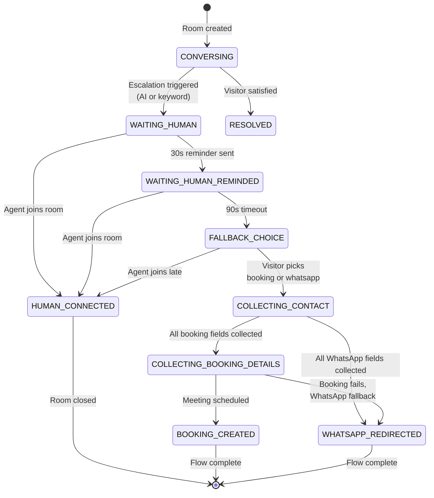
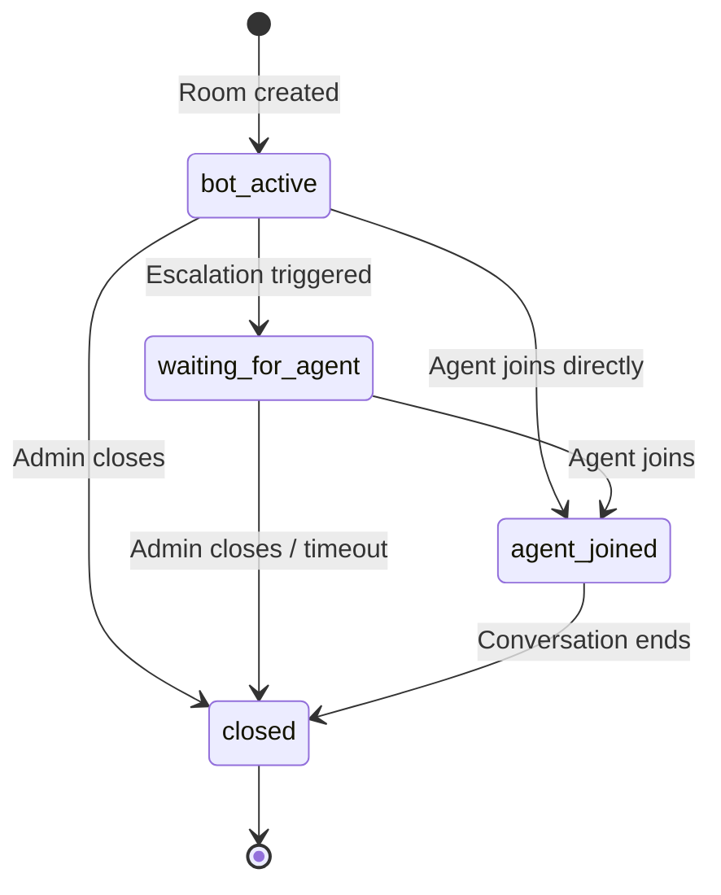
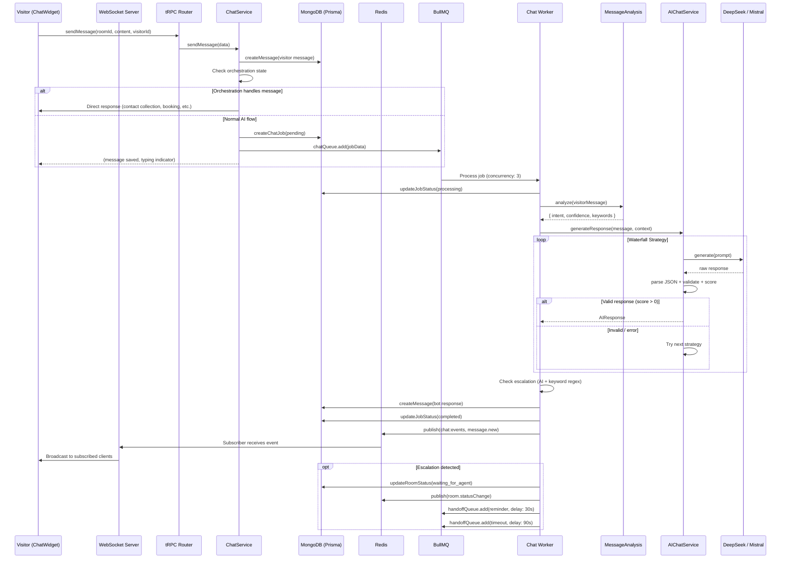
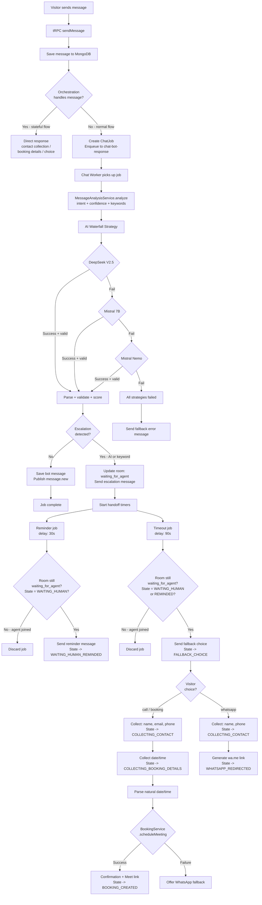

# Chatbot System Guide — Alpadev AI

> Developer onboarding reference for the live chat system: AI bot, human escalation, fallback paths, and real-time WebSocket architecture.

---

## Table of Contents

1. [Overview](#1-overview)
2. [End-to-End Flow](#2-end-to-end-flow)
3. [Core Process Flow](#3-core-process-flow)
4. [Queue System](#4-queue-system)
5. [WebSocket Layer](#5-websocket-layer)
6. [WebSocket + AI Interaction](#6-websocket--ai-interaction)
7. [Queue Process Flow (Detailed)](#7-queue-process-flow-detailed)
8. [Detailed Service Inventory](#8-detailed-service-inventory)
9. [Improvement Opportunities](#9-improvement-opportunities)

---

## 1. Overview

The Alpadev AI chat system is a live website chatbot combining **WebSocket real-time messaging**, **async AI processing** (Redis + BullMQ workers), **human agent escalation**, and **fallback outcomes** (Google Calendar booking or WhatsApp redirect).

**Primary users:**

- **Visitors** interact via `ChatWidget` (floating bottom-right widget)
- **Agents / Admins** manage conversations from `/dashboard/chat`

### Architecture Diagram



### Component Summary

| Component | File Path | Role |
|-----------|-----------|------|
| ChatWidget | `apps/frontend/components/chat/ChatWidget.tsx` | Visitor-facing floating chat UI |
| Agent Dashboard | `apps/frontend/app/dashboard/chat/page.tsx` | Admin panel for managing conversations |
| WebSocket Server | `apps/frontend/server.ts` | Custom HTTP + `ws` on `/ws` path |
| useWebSocket Hook | `apps/frontend/hooks/useWebSocket.ts` | Client reconnect logic (exponential backoff) |
| Chat Router | `packages/api/src/routers/chat/chat.router.ts` | tRPC procedures (public + admin) |
| ChatService | `packages/api/src/routers/chat/chat.service.ts` | Singleton with event bus + Redis pub/sub |
| ChatRepository | `packages/api/src/routers/chat/chat.repository.ts` | Prisma data access layer |
| OrchestrationService | `packages/api/src/routers/chat/orchestration.service.ts` | Conversation state machine |
| Chat Queue | `packages/api/src/jobs/chat/chat.queue.ts` | `chat-bot-response` BullMQ queue |
| Chat Worker | `packages/api/src/jobs/chat/chat.worker.ts` | AI processing + escalation detection |
| Handoff Queue | `packages/api/src/jobs/chat/handoff.queue.ts` | `handoff-timers` BullMQ queue |
| Handoff Worker | `packages/api/src/jobs/chat/handoff.worker.ts` | Reminder (30s) and timeout (90s) jobs |
| ChatJobRepository | `packages/api/src/jobs/chat/chat-job.repository.ts` | Job tracking (pending/processing/completed/failed) |
| Connection Factory | `packages/api/src/jobs/connection.ts` | Redis/BullMQ connection options |
| AIChatService | `packages/api/src/routers/chatbot/service/ai.service.ts` | AI waterfall strategy orchestration |
| MessageAnalysisService | `packages/api/src/routers/chatbot/service/analysis.service.ts` | Intent classification + keyword extraction |
| System Prompt | `packages/api/src/prompts/chatbot.prompt.ts` | `getChatbotSystemPrompt()` |
| AI Strategies | `packages/api/src/routers/chatbot/service/strategies/` | DeepSeek, Mistral7B, MistralNemo, (Gemini disabled) |
| Validation Schemas | `packages/validations/schemas/chat/chat.schema.ts` | Zod schemas + orchestration types |
| Prisma Models | `packages/db/prisma/schema.prisma` | ChatRoom, ChatMessage, ChatJob |

---

## 2. End-to-End Flow

### Happy Path (Bot Resolution)

1. Visitor clicks chat bubble -> `ChatWidget` opens
2. `chat.createRoom` tRPC mutation fires with `visitorId` (UUID from localStorage)
3. ChatService creates room (status: `bot_active`), sends bot greeting via `message.new` event
4. Visitor sends message -> tRPC `chat.sendMessage`
5. ChatService saves message, checks orchestration state, creates `ChatJob`, enqueues to `chat-bot-response`
6. Chat Worker picks up job -> `MessageAnalysisService.analyze()` -> `AIChatService.generateResponse()` (waterfall: DeepSeek -> Mistral 7B -> Mistral Nemo)
7. Bot response saved to DB, `message.new` published via Redis pub/sub
8. WebSocket server broadcasts to subscribed clients -> ChatWidget displays response

### Human Escalation Path

1. Escalation detected (AI `actionType === "escalate_to_human"` OR keyword regex match)
2. Room status updated to `waiting_for_agent`
3. Escalation message sent to visitor ("connecting you with a team member...")
4. `room.statusChange` event broadcast -> Agent Dashboard highlights room
5. Handoff timers started: reminder at 30s, timeout at 90s
6. Agent clicks "Join" -> `chat.joinRoom` -> timers cancelled, status to `agent_joined`
7. Agent and visitor converse in real-time via WebSocket

### Timeout Fallback Path

1. **30s** — No agent joined: reminder message ("still looking for an available team member...")
2. Orchestration state transitions to `WAITING_HUMAN_REMINDED`
3. **90s** — No agent joined: timeout fires, fallback choice presented:
   - "Schedule a call" (Google Meet)
   - "Continue on WhatsApp"
4. Visitor picks option -> conversation enters contact collection flow

### Booking Sub-Flow

1. Visitor chooses "call" -> state transitions to `COLLECTING_CONTACT`
2. Bot collects required fields: **name**, **email**, **phone** (+ optional: reason, timezone)
3. Fields extracted via regex (email, phone patterns) with up to 2 re-prompts on invalid input
4. State transitions to `COLLECTING_BOOKING_DETAILS` -> bot asks for preferred date/time
5. Natural date/time parsing (supports "tomorrow at 3pm", "Monday", "2026-03-01", Spanish equivalents)
6. `BookingService.scheduleMeeting()` creates Google Calendar event with Meet link
7. Confirmation message with Meet link sent to visitor
8. Confirmation email sent via Resend
9. `booking.created` event broadcast

### WhatsApp Sub-Flow

1. Visitor chooses "whatsapp" -> state transitions to `COLLECTING_CONTACT`
2. Bot collects required fields: **name**, **phone**
3. `wa.me/573205890433?text={prefilled}` link generated
4. Link message sent to visitor with prefilled text: "Hi, I'm {name}. I was chatting on your website..."
5. `whatsapp.link_sent` event broadcast

---

## 3. Core Process Flow

### Orchestration States

The `OrchestrationService` manages an 11-state machine stored in `ChatRoom.metadata.orchestration`:



### ChatRoom Status Lifecycle



### Key Decision Points

- **Escalation detection**: Dual-layer check in Chat Worker — AI-driven (`actionType === "escalate_to_human"`) + keyword regex (44 patterns in English and Spanish)
- **Orchestration intercept**: `handleVisitorMessage()` checks state before AI — if the conversation is in a stateful flow (contact collection, booking details, fallback choice), the orchestration service handles the message directly without enqueuing an AI job
- **Timer guards**: Both reminder and timeout jobs verify room status is still `waiting_for_agent` before acting (prevents stale timer execution if agent already joined)
- **Field extraction**: Regex-based extraction for email, phone, name — with 2 re-prompt attempts before skipping optional fields
- **Booking failure**: If `BookingService.scheduleMeeting()` fails, offers WhatsApp as fallback

---

## 4. Queue System

### Why Queues?

- **Decouple UI from AI latency** — visitor gets instant acknowledgment, AI processes async
- **Retries with backoff** — transient AI API failures don't lose messages
- **Independent scaling** — workers scale separately from web server
- **Timer orchestration** — BullMQ delayed jobs for handoff reminders/timeouts

### `chat-bot-response` Queue

| Property | Value |
|----------|-------|
| **File** | `packages/api/src/jobs/chat/chat.queue.ts` |
| **Queue Name** | `chat-bot-response` |
| **Producer** | `ChatService.sendMessage()` |
| **Consumer** | `packages/api/src/jobs/chat/chat.worker.ts` |
| **Concurrency** | 3 |
| **Attempts** | 3 |
| **Backoff** | Exponential, 1000ms initial |
| **removeOnComplete** | Keep last 100 |
| **removeOnFail** | Keep last 50 |

**Job Data Schema:**

```json
{
  "jobId": "ObjectId (ChatJob record ID)",
  "roomId": "ObjectId (ChatRoom ID)",
  "visitorMessage": "string (visitor message content)"
}
```

**Retry / Failure Behavior:**
- Attempt 1 fails -> retry after ~1s
- Attempt 2 fails -> retry after ~2s
- Attempt 3 fails -> `handleFailure()` sends fallback error message to chat and marks `ChatJob` as failed

### `handoff-timers` Queue

| Property | Value |
|----------|-------|
| **File** | `packages/api/src/jobs/chat/handoff.queue.ts` |
| **Queue Name** | `handoff-timers` |
| **Producer** | `OrchestrationService.startHandoffTimers()` |
| **Consumer** | `packages/api/src/jobs/chat/handoff.worker.ts` |
| **Concurrency** | 5 |
| **Attempts** | 1 (no retries — timer jobs are time-sensitive) |
| **removeOnComplete** | Keep last 200 |
| **removeOnFail** | Keep last 100 |

**Job Data Schema:**

```json
{
  "roomId": "string (ChatRoom ID)",
  "type": "reminder | timeout"
}
```

**Timer Delays:**
- `HANDOFF_REMINDER_DELAY_MS` = 30,000ms (30s) — "still looking for a team member..."
- `HANDOFF_TIMEOUT_DELAY_MS` = 90,000ms (90s) — fallback choice (booking / WhatsApp)

### Redis Connection Factory

**File:** `packages/api/src/jobs/connection.ts`

| Export | Purpose |
|--------|---------|
| `getBullMQConnectionOptions()` | Parses `REDIS_URL` (default `redis://localhost:6379`), sets `maxRetriesPerRequest: null` (BullMQ requirement) |
| `createSubscriberConnection()` | ioredis instance for pub/sub subscriptions, exponential backoff retry (200ms–5000ms) |
| `createPublisherConnection()` | ioredis instance for publishing events, exponential backoff retry (200ms–5000ms) |

### Running Workers

```bash
# Chat AI worker (processes bot responses)
npx tsx packages/api/src/jobs/chat/chat.worker.ts

# Handoff timer worker (processes reminders + timeouts)
npx tsx packages/api/src/jobs/chat/handoff.worker.ts
```

Both workers must be running in production. They connect to Redis and process jobs independently. Graceful shutdown is handled via process signal listeners.

---

## 5. WebSocket Layer

### Server Architecture

**File:** `apps/frontend/server.ts`

The Next.js app uses a custom HTTP server with the `ws` library mounted on the `/ws` path using `noServer: true` mode. The HTTP `upgrade` event is intercepted — only requests to `/ws` are upgraded; all others are destroyed.

### Client Tracking

```typescript
interface WSClient {
  ws: WebSocket
  roomId?: string     // Subscribed room (visitors)
  visitorId?: string  // Visitor UUID
  isAgent?: boolean   // Agent dashboard flag
}
```

All connected clients are tracked in a `Set<WSClient>`.

### Subscription Message Types

| Message Type | Sender | Effect |
|--------------|--------|--------|
| `subscribe` | Visitor | Sets `roomId` + `visitorId` on client |
| `subscribe.agent` | Agent Dashboard | Sets `isAgent = true`, optionally `roomId` |
| `unsubscribe` | Visitor | Clears `roomId` |
| `ping` | Any client | Server responds with `pong` |

### Event Routing Logic

When a `ChatEvent` arrives via Redis subscription:

1. **Room-specific events** (e.g., `message.new`, `room.typing`): sent to all clients where `client.roomId === event.roomId`
2. **Agent dashboard events** (`room.created`, `room.statusChange`, `handoff.reminder`, `handoff.timeout`, `handoff.cancelled`, `booking.created`, `whatsapp.link_sent`): sent to **all** clients with `isAgent === true`

### Redis Pub/Sub Bridge

**Why needed:** The ChatService singleton lives in the API package, but WebSocket connections live in the Next.js server process. When running multiple instances or when the module loads in separate contexts, Redis pub/sub ensures events reach all WebSocket servers.

**Flow:**
1. `ChatService.emit(event)` -> publishes to Redis channel `chat:events`
2. Redis subscriber in `server.ts` receives event -> calls broadcast to matching WebSocket clients
3. `ChatService.localEmit(event)` dispatches to in-process listeners (room-specific + global callbacks)

### Frontend Hook: `useWebSocket`

**File:** `apps/frontend/hooks/useWebSocket.ts`

| Feature | Detail |
|---------|--------|
| **URL** | `ws://` or `wss://` + `window.location.host` + `/ws` |
| **Reconnect** | Exponential backoff: 1s, 2s, 4s, 8s, ... capped at 30s |
| **Retry reset** | On successful `onopen`, retries reset to 0 |
| **Status states** | `connecting`, `connected`, `disconnected` |
| **API** | `connect()`, `send(data)`, `disconnect()`, `status` |
| **Cleanup** | Clears timeout + closes socket on unmount |

### Event Type Catalog

| Event Type | Producer | Data Fields | Consumers |
|------------|----------|-------------|-----------|
| `message.new` | ChatService, Chat Worker, Handoff Worker | `message: ChatMessage` | ChatWidget, Agent Dashboard |
| `room.created` | ChatService | `room: ChatRoom` | Agent Dashboard |
| `room.statusChange` | ChatService, Chat Worker | `room: { id, status, agentName? }` | ChatWidget, Agent Dashboard |
| `room.typing` | ChatService | `{ roomId, senderType, isTyping }` | ChatWidget, Agent Dashboard |
| `handoff.reminder` | Handoff Worker | `{ roomId, elapsedSeconds: 30 }` | ChatWidget, Agent Dashboard |
| `handoff.timeout` | Handoff Worker | `{ roomId, choices, orchestration }` | ChatWidget, Agent Dashboard |
| `handoff.cancelled` | ChatService | `{ roomId }` | ChatWidget, Agent Dashboard |
| `booking.created` | OrchestrationService | `{ roomId, bookingId, meetLink }` | ChatWidget, Agent Dashboard |
| `whatsapp.link_sent` | OrchestrationService | `{ roomId, link }` | ChatWidget, Agent Dashboard |
| `orchestration.stateChange` | OrchestrationService | `{ roomId, state, previousState }` | Agent Dashboard |

---

## 6. WebSocket + AI Interaction

### Where AI Runs

AI processing happens **exclusively in server-side workers** (Chat Worker). The web server never blocks on AI calls — it enqueues a BullMQ job and returns immediately. The response arrives asynchronously via Redis pub/sub -> WebSocket broadcast.

### Sequence Diagram



### AI Waterfall Strategy

The `AIChatService` iterates through strategies in order. The first valid, scored response wins:

| Order | Strategy | Model | Weight | Status |
|-------|----------|-------|--------|--------|
| 1 | `DeepSeekStrategy` | DeepSeek V2.5 (deepseek-chat) | 1.0 | **Primary** |
| 2 | `Mistral7BStrategy` | Open Mistral 7B | 1.0 | Fallback 1 |
| 3 | `MistralNemoStrategy` | Mistral Nemo 12B | 0.8 | Fallback 2 |
| 4 | `GeminiStrategy` | Gemini Flash 2.0 | 1.0 | **Disabled** (quota) |

All strategies implement `IGenerativeAIStrategy`:

```typescript
interface IGenerativeAIStrategy {
  modelName: string
  weight: number
  generate(prompt: string): Promise<AIAttempt>
}
```

**Scoring** (`AIResponseValidator.validateAndScore()`):
- Base score = strategy weight
- `-0.2` if `needsMoreInfo === true`
- `+0.1` if `requiresAction === true` and `actionType !== "none"`
- `-0.1` if response text < 10 chars
- Clamped to `[0, 1.5]`
- Score must be `> 0` and valid to accept

If **all strategies fail**, returns `{ success: false, error: "AI_UNAVAILABLE_ALL_MODELS" }` and the worker falls back to generic error message.

### AI Response Structure

```typescript
interface AIResponse {
  messageType: "text" | "interactive"
  response: string               // Bot message text (max 600 chars enforced)
  requiresAction: boolean
  actionType: ActionType          // "schedule_meeting" | "escalate_to_human" | "none" | ...
  actionData: Record<string, any> // Context for the action
  nextSteps: string[]
  needsMoreInfo: boolean
  missingInfo: string[]
}
```

**Action Types:**
`schedule_meeting`, `submit_request`, `get_services_info`, `get_pricing`, `general_info`, `escalate_to_human`, `none`

### Intent Analysis

`MessageAnalysisService.analyze()` classifies messages by keyword matching (priority order):

| Intent | Base Confidence | Example Keywords |
|--------|----------------|------------------|
| `greeting` | 0.6 | hola, hello, hi, buenos dias |
| `booking_request` | 0.6 | meeting, agendar, schedule, demo, reunión |
| `pricing_inquiry` | 0.6 | precio, price, costo, presupuesto |
| `support_request` | 0.55 | problema, error, bug, ayuda, soporte |
| `software_inquiry` | 0.5 | software, app, web, React, Node, Docker |
| `marketing_inquiry` | 0.5 | marketing, SEO, ads, branding |
| `finance_inquiry` | 0.5 | blockchain, web3, crypto, DeFi |
| `unknown` | 0.4 | (no matches) |

Confidence increases by `+0.1` (or `+0.08`) per additional keyword match, capped at `1.0`.

### Escalation Detection

**Dual-layer detection in Chat Worker:**

1. **AI-driven**: If `aiResponse.data.actionType === "escalate_to_human"`
2. **Keyword regex**: 44 patterns (English + Spanish):
   - English: "talk to a real person", "human agent", "speak with someone", "real person", etc.
   - Spanish: "hablar con una persona", "agente real", "necesito un humano", etc.

Either trigger transitions the room to `waiting_for_agent` and starts handoff timers.

### System Prompt Summary

**File:** `packages/api/src/prompts/chatbot.prompt.ts`

- **Identity**: "Alpadev AI" — sales & support assistant for custom software development
- **Language**: Matches visitor language, defaults to English
- **Tone**: Professional, approachable, consultative (not pushy)
- **Limits**: Max 6 lines, max 3 emojis per response
- **Services**: Custom software, MVP development, API integration, cloud/DevOps, AI/ML, team augmentation
- **Output**: Mandatory JSON format matching `AIResponse` structure
- **Escalation rules**: Explicit human request, complex technical question, high buying intent, frustration signals

---

## 7. Queue Process Flow (Detailed)



### Failure Handling

- **Chat Worker**: On final failure (3rd attempt), `handleFailure()` saves a generic error message to the chat ("I'm having some trouble right now...") and marks the ChatJob as `failed`
- **Handoff Worker**: Timer jobs have 1 attempt only. Guards prevent stale execution — if the room state has already moved past the expected state, the job is silently discarded
- **Field Collection**: Invalid input gets up to 2 re-prompts. Optional fields (reason, timezone) are skipped after 2 failures

---

## 8. Detailed Service Inventory

### Frontend Layer

#### ChatWidget
- **File**: `apps/frontend/components/chat/ChatWidget.tsx`
- **Responsibility**: Floating visitor chat UI (bottom-right, z-10000)
- **Key State**: `messages`, `roomId`, `roomStatus`, `orchestrationState`, `showFallbackButtons`, `isTyping`, `agentName`
- **Storage**: `localStorage.alpadev_visitor_id` (UUID), `localStorage.alpadev_chat_room_id`
- **Dependencies**: `useWebSocket`, tRPC (`chat.createRoom`, `chat.sendMessage`)

#### Agent Dashboard
- **File**: `apps/frontend/app/dashboard/chat/page.tsx`
- **Responsibility**: Admin panel — room list, conversation view, join/close actions
- **Key State**: `rooms`, `selectedRoomId`, `messages`
- **Features**: Room priority sorting (`waiting_for_agent` first), orchestration field display, mobile responsive, auth error handling
- **Dependencies**: `useWebSocket`, tRPC (`chat.getActiveRooms`, `chat.getMessages`, `chat.joinRoom`, `chat.sendMessage`, `chat.closeRoom`)

#### useWebSocket Hook
- **File**: `apps/frontend/hooks/useWebSocket.ts`
- **Responsibility**: WebSocket connection management with auto-reconnect
- **Key Methods**: `connect()`, `send(data)`, `disconnect()`
- **Reconnect**: Exponential backoff 1s -> 30s max, reset on successful connection
- **Dependencies**: None (standalone hook)

### Server Layer

#### WebSocket Server
- **File**: `apps/frontend/server.ts`
- **Responsibility**: HTTP server + `ws` library on `/ws` path, client tracking, event broadcasting
- **Key Data**: `Set<WSClient>` tracking connected clients with `roomId`, `visitorId`, `isAgent` flags
- **Message Types**: `subscribe`, `subscribe.agent`, `unsubscribe`, `ping`/`pong`
- **Dependencies**: `ChatService` (global subscription), Redis subscriber

### API Layer

#### Chat Router
- **File**: `packages/api/src/routers/chat/chat.router.ts`
- **Responsibility**: tRPC procedure definitions for chat operations
- **Procedures**:
  - `createRoom` (public) — create/resume chat room
  - `sendMessage` (public) — send message as visitor/agent/bot
  - `getMessages` (public) — paginated message fetch
  - `joinRoom` (admin) — agent joins room
  - `closeRoom` (admin) — close conversation
  - `getActiveRooms` (admin) — dashboard room list
  - `typing` (public) — typing indicator
- **Dependencies**: ChatService singleton

#### ChatService
- **File**: `packages/api/src/routers/chat/chat.service.ts`
- **Responsibility**: Core service — room lifecycle, message handling, event bus, Redis pub/sub
- **Key Methods**: `createRoom()`, `sendMessage()`, `joinRoom()`, `closeRoom()`, `escalateToHuman()`, `emitTyping()`, `getMessages()`, `getActiveRooms()`, `subscribeToRoom()`, `subscribeGlobal()`
- **Pattern**: Singleton via `getChatService()`
- **Event Channel**: `chat:events` (Redis pub/sub)
- **Dependencies**: ChatRepository, OrchestrationService, chatQueue (BullMQ)

#### ChatRepository
- **File**: `packages/api/src/routers/chat/chat.repository.ts`
- **Responsibility**: Prisma data access for ChatRoom, ChatMessage
- **Key Methods**: `createRoom()`, `findRoomById()`, `findRoomByVisitorId()`, `updateRoomStatus()`, `updateRoomVisitorInfo()`, `updateRoomMetadata()`, `createMessage()`, `getMessages()`, `getActiveRooms()`, `getRoomCount()`
- **Dependencies**: Prisma client

#### OrchestrationService
- **File**: `packages/api/src/routers/chat/orchestration.service.ts`
- **Responsibility**: Conversation state machine — manages fallback flow, contact collection, booking/WhatsApp paths
- **Key Methods**: `getOrchestration()`, `setOrchestration()`, `startHandoffTimers()`, `cancelHandoffTimers()`, `onAgentJoined()`, `handleVisitorMessage()`, `handleFallbackChoice()`, `handleContactCollection()`, `handleBookingDetails()`
- **State Storage**: `ChatRoom.metadata.orchestration` (JSON field)
- **Pattern**: Singleton via `getOrchestrationService()`
- **Dependencies**: ChatRepository, handoffQueue, BookingService

### Queue Layer

#### Chat Queue
- **File**: `packages/api/src/jobs/chat/chat.queue.ts`
- **Exports**: `chatQueue`, `CHAT_QUEUE_NAME`, `CHAT_EVENTS_CHANNEL`, `ChatJobData`
- **Config**: 3 attempts, exponential backoff (1s base), concurrency 3

#### Chat Worker
- **File**: `packages/api/src/jobs/chat/chat.worker.ts`
- **Responsibility**: AI response generation, escalation detection, event publishing
- **Dependencies**: ChatJobRepository, ChatRepository, AIChatService, MessageAnalysisService, OrchestrationService

#### ChatJobRepository
- **File**: `packages/api/src/jobs/chat/chat-job.repository.ts`
- **Responsibility**: Track job lifecycle (pending -> processing -> completed/failed)
- **Key Methods**: `create()`, `updateStatus()`, `complete()`, `fail()`

#### Handoff Queue
- **File**: `packages/api/src/jobs/chat/handoff.queue.ts`
- **Exports**: `handoffQueue`, `HANDOFF_QUEUE_NAME`, `HANDOFF_REMINDER_DELAY_MS` (30s), `HANDOFF_TIMEOUT_DELAY_MS` (90s)
- **Config**: 1 attempt, concurrency 5

#### Handoff Worker
- **File**: `packages/api/src/jobs/chat/handoff.worker.ts`
- **Responsibility**: Process reminder (30s) and timeout (90s) delayed jobs with state guards
- **Dependencies**: ChatRepository, Redis publisher

#### Connection Factory
- **File**: `packages/api/src/jobs/connection.ts`
- **Exports**: `getBullMQConnectionOptions()`, `createSubscriberConnection()`, `createPublisherConnection()`
- **Config**: `REDIS_URL` env var, default `redis://localhost:6379`, retry backoff 200ms-5000ms

### AI Layer

#### AIChatService
- **File**: `packages/api/src/routers/chatbot/service/ai.service.ts`
- **Responsibility**: AI waterfall strategy orchestration, prompt building, response parsing/validation
- **Key Methods**: `generateResponse()`, `buildPrompt()`, `parseResponse()`, `createSimpleResponse()`, `enforceResponseGuards()`
- **Constants**: `MAX_RESPONSE_CHAR_LENGTH = 600`
- **Dependencies**: AI strategies, AIResponseValidator, system prompt

#### MessageAnalysisService
- **File**: `packages/api/src/routers/chatbot/service/analysis.service.ts`
- **Responsibility**: Intent classification and keyword extraction
- **Key Method**: `analyze(message)` -> `{ intent, confidence, keywords, rawText }`
- **Dependencies**: None (standalone)

#### AI Strategies
- **DeepSeekStrategy**: `packages/api/src/routers/chatbot/service/strategies/deepseek.strategy.ts` — Primary, weight 1.0
- **Mistral7BStrategy**: `packages/api/src/routers/chatbot/service/strategies/mistral7b.strategy.ts` — Fallback 1, weight 1.0
- **MistralNemoStrategy**: `packages/api/src/routers/chatbot/service/strategies/mistralNemo.strategy.ts` — Fallback 2, weight 0.8
- **GeminiStrategy**: `packages/api/src/routers/chatbot/service/strategies/gemini.strategy.ts` — Disabled (quota), weight 1.0

#### AIResponseValidator
- **File**: `packages/api/src/routers/chatbot/service/validator.service.ts`
- **Responsibility**: Zod validation + quality scoring of AI responses
- **Scoring**: Base weight +/- modifiers, clamped to [0, 1.5]

#### System Prompt
- **File**: `packages/api/src/prompts/chatbot.prompt.ts`
- **Export**: `getChatbotSystemPrompt()`
- **Content**: Bot identity, services catalog, pricing models, 9 behavior rules, mandatory JSON output format

#### AI Config
- **File**: `packages/api/src/config/ai.config.ts`
- **Exports**: `ai` (Mistral 7B), `aiFallback` (Mistral Nemo), `aiDeepSeek`, `aiGemini` (conditional)
- **Settings**: temperature 0.3, maxOutputTokens 1024 across all models

### Integration Layer

#### BookingService
- **File**: `packages/api/src/routers/booking/service/booking.service.ts`
- **Responsibility**: Meeting booking workflow — Google Calendar event + DB record + email confirmation
- **Key Method**: `scheduleMeeting()`
- **Dependencies**: CalendarService, BookingRepository, @package/email (Resend)

### Data Layer

#### Prisma Models

**ChatRoom**
| Field | Type | Notes |
|-------|------|-------|
| `id` | String (ObjectId) | `@id @default(auto()) @map("_id")` |
| `status` | ChatRoomStatus | Default: `bot_active` |
| `visitorId` | String | Client-generated UUID |
| `visitorName` | String? | Collected during conversation |
| `visitorEmail` | String? | Collected during conversation |
| `visitorIp` | String? | Extracted from headers |
| `metadata` | Json? | Stores orchestration state |
| `closedAt` | DateTime? | Set when room closed |
| `messages` | ChatMessage[] | Cascade delete |
| `jobs` | ChatJob[] | Related jobs |
| `createdAt` | DateTime | Auto |
| `updatedAt` | DateTime | Auto |

**ChatMessage**
| Field | Type | Notes |
|-------|------|-------|
| `id` | String (ObjectId) | `@id @default(auto()) @map("_id")` |
| `roomId` | String | `@db.ObjectId` FK |
| `senderType` | ChatSenderType | `visitor`, `bot`, `agent` |
| `senderName` | String? | Agent name or null |
| `content` | String | Message text |
| `createdAt` | DateTime | Auto |

**ChatJob**
| Field | Type | Notes |
|-------|------|-------|
| `id` | String (ObjectId) | `@id @default(auto()) @map("_id")` |
| `roomId` | String | `@db.ObjectId` FK |
| `status` | ChatJobStatus | `pending`, `processing`, `completed`, `failed` |
| `payload` | Json | `{ visitorMessage, roomId }` |
| `result` | Json? | `{ botMessageId, response }` |
| `error` | String? | Error message on failure |
| `createdAt` | DateTime | Auto |
| `updatedAt` | DateTime | Auto |

#### Validation Schemas
- **File**: `packages/validations/schemas/chat/chat.schema.ts`
- **Enums**: `ChatRoomStatusEnum`, `ChatSenderTypeEnum`, `OrchestrationStateEnum`, `FallbackModeEnum`
- **Input Schemas**: `CreateChatRoomSchema`, `SendChatMessageSchema`, `JoinChatRoomSchema`, `CloseChatRoomSchema`, `GetChatMessagesSchema`, `GetActiveRoomsSchema`, `TypingIndicatorSchema`, `FallbackChoiceSchema`, `HandoffTimerJobDataSchema`
- **Composite Schemas**: `CollectedFieldsSchema`, `BookingDetailsSchema`, `OrchestrationTimersSchema`, `OrchestrationMetadataSchema`

---

## 9. Improvement Opportunities

### P0 — Security

| Issue | Detail |
|-------|--------|
| **WebSocket agent auth gap** | `subscribe.agent` does not verify admin session — any client can set `isAgent: true` and receive all room events |
| **Room ID enumeration** | Public procedures (`sendMessage`, `getMessages`) accept any `roomId` — no ownership check beyond `visitorId` on `sendMessage` |
| **Visitor ID spoofing** | `visitorId` is a client-generated UUID stored in localStorage — can be forged to impersonate another visitor's session |

### P1 — Reliability

| Issue | Detail |
|-------|--------|
| **No Dead Letter Queue (DLQ)** | Failed jobs after 3 attempts are logged but not routed to a DLQ for inspection/replay |
| **No booking idempotency** | If `scheduleMeeting()` is called twice (e.g., retry after partial failure), duplicate calendar events may be created |
| **AI lacks conversation context** | Chat Worker sends only the current visitor message to AI — no conversation history window, limiting contextual responses |
| **Weak heartbeat** | `ping`/`pong` is client-initiated only — no server-side health checks to detect zombie connections |
| **No message delivery confirmation** | WebSocket broadcast is fire-and-forget — no acknowledgment that the client received the message |

### P2 — Maintainability

| Issue | Detail |
|-------|--------|
| **Duplicate escalation regex** | Escalation keyword patterns exist in both `chat.service.ts` and `chat.worker.ts` — should be a shared constant |
| **Hardcoded WhatsApp number** | `573205890433` is hardcoded in `orchestration.service.ts` — should be an env var |
| **Console-only logging** | All logging uses `console.log`/`console.error` — no structured logging or log levels |
| **Missing worker scripts** | No `package.json` scripts for running workers — requires manual `npx tsx` commands |
| **No typing debounce** | Typing indicator events are emitted on every keystroke without throttling |

### Privacy

| Data Collected | Source |
|----------------|--------|
| Visitor name | Collected during fallback flow |
| Email | Collected during booking flow |
| Phone | Collected during booking/WhatsApp flow |
| IP address | Extracted from request headers on room creation |
| Messages | All conversation content stored in MongoDB |

**Gap**: No data retention policy or automated purge mechanism for chat data.

---

## Assumptions

1. **Primary chat path** is `chat.*` router (live chat with WebSocket); `chatbot.*` is the secondary/legacy AI service layer reused for response generation
2. **Both workers must be running** in production (`chat.worker.ts` + `handoff.worker.ts`)
3. **Redis is required** infrastructure (BullMQ job storage + pub/sub event distribution)
4. **WhatsApp is redirect-link only** — generates a `wa.me` URL, not in-chat bot continuation
5. **`bot_active`** is the default room status (not `active`)
6. **Agent authentication** relies on `adminProcedure` in tRPC but is **not enforced** on the WebSocket layer
7. **Gemini strategy is disabled** in the AI waterfall due to quota issues — infrastructure remains for future re-enablement
