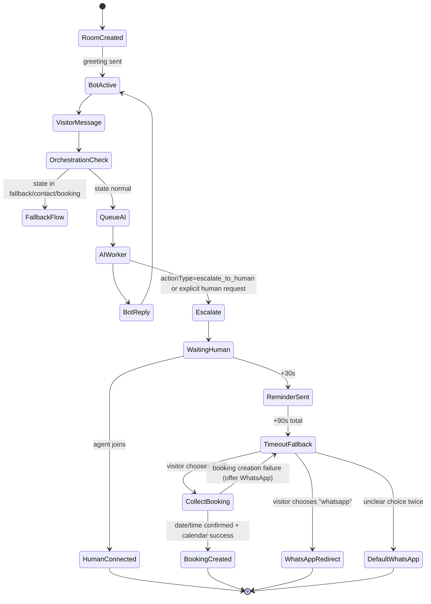
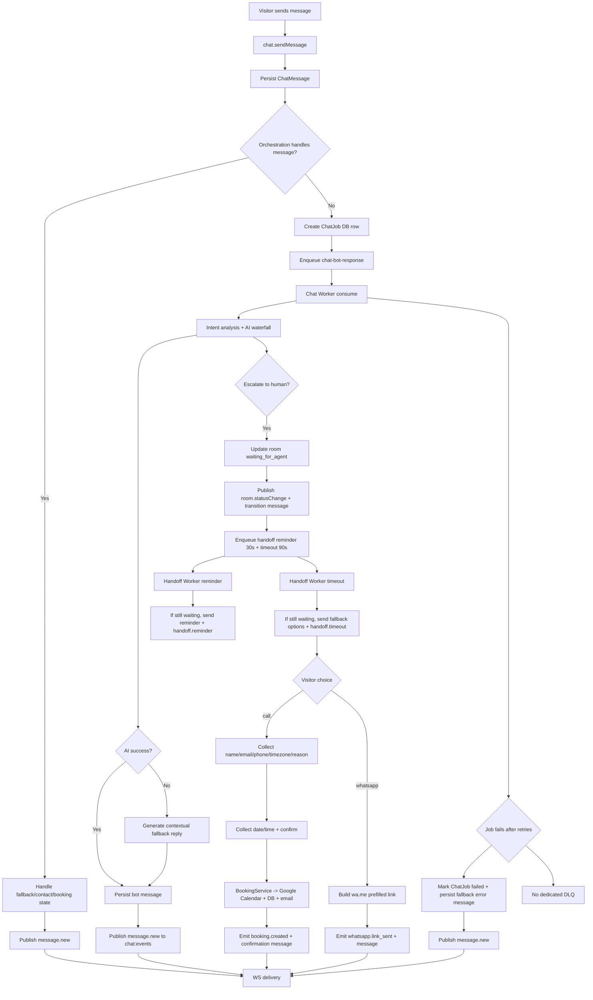

# Chatbot System Guide (Codex)

## 1) Overview: What is the chatbot in this project?

This project contains a **live website chatbot** that combines:
- Real-time messaging via WebSocket
- Async AI response generation via Redis + BullMQ workers
- Human escalation to an agent dashboard
- Fallback outcomes when humans are unavailable:
  - Schedule a call (Google Calendar + email confirmation)
  - Continue on WhatsApp (prefilled deep link)

### Purpose and users

Primary users:
- **Website visitors** using the floating `ChatWidget`
- **Internal agents/admins** using `/dashboard/chat`

Main goals:
- Handle common support/sales questions automatically
- Qualify leads and collect contact details
- Escalate to a human when needed
- Avoid dead-ends by offering booking or WhatsApp handoff

### Key components

- **Web app + WebSocket server**: `apps/frontend/server.ts`
- **Live chat API/service layer**: `packages/api/src/routers/chat/*`
- **AI generation layer (waterfall models)**: `packages/api/src/routers/chatbot/service/*`
- **Queue layer**:
  - `chat-bot-response` queue for AI responses
  - `handoff-timers` queue for reminder/timeout orchestration
- **Workers**:
  - `chat.worker.ts`
  - `handoff.worker.ts`
- **Persistence** (Mongo via Prisma):
  - `ChatRoom`, `ChatMessage`, `ChatJob`, `Booking`, `ConversationSession`, `ConversationMessage`
- **Integrations**:
  - Redis (queue + pub/sub)
  - Google Calendar (meeting creation + Meet link)
  - Resend (booking confirmation email)
  - WhatsApp redirect link (`wa.me`)

## 2) End-to-end: How it works step by step

### Automated resolution path (happy path)

1. Visitor opens site and launches chat widget.
2. Frontend calls `chat.createRoom(visitorId)`.
3. Backend creates (or reuses) `ChatRoom` and sends greeting `ChatMessage` from bot.
4. Visitor sends message via `chat.sendMessage`.
5. Message is saved immediately and emitted as `message.new`.
6. Orchestration checks if the message belongs to an active fallback flow (booking/WhatsApp collection).
7. If not handled by orchestration and room is `bot_active`, backend enqueues `chat-bot-response` job.
8. Chat worker consumes job, analyzes intent, calls AI waterfall, builds response.
9. Worker saves bot message and publishes event to Redis channel `chat:events`.
10. WebSocket server receives event through `ChatService` Redis subscriber and pushes to subscribed client.
11. Visitor receives bot response in real time.

### Human handoff path

1. AI (or explicit user language) triggers escalation intent.
2. Room state changes `bot_active -> waiting_for_agent`.
3. Bot posts transition message: "connecting you with a team member...".
4. Orchestration schedules handoff timers:
   - 30s reminder
   - 90s timeout
5. Agent joins from dashboard (`chat.joinRoom`) before timeout:
   - Timers are cancelled
   - State changes to `agent_joined`
   - Bot posts join transition message
   - Visitor/agent continue as human chat

### Timeout fallback path (no agent available)

1. Handoff reminder job fires at 30s -> reminder bot message.
2. Timeout job fires at 90s -> fallback options message.
3. Visitor chooses:
   - `call` -> bot collects contact details + preferred date/time -> creates booking
   - `whatsapp` -> bot sends prefilled WhatsApp link
4. System emits `booking.created` or `whatsapp.link_sent` events.

## 3) Core process flow (high-level)



Key decision points:
- Intent detection / escalation signal
- Is orchestration state already active?
- Agent availability before handoff timeout
- Visitor fallback choice (`call` vs `whatsapp`)
- Booking parse/validation success or failure

## 4) Queue system: How queues work in this project

### Why queues are used

Queues decouple UI latency from heavy operations:
- AI generation is async and potentially slow/unreliable
- Handoff timers need delayed execution independent of request lifecycle
- Worker processes can scale independently from web server

### Queue types, producers, consumers

1. `chat-bot-response`
- Producer: `ChatService.enqueueBotResponse`
- Consumer: `chat.worker.ts`
- Purpose: generate bot responses asynchronously

2. `handoff-timers`
- Producer: `OrchestrationService.startHandoffTimers`
- Consumer: `handoff.worker.ts`
- Purpose: reminder + timeout flow for human handoff

### Retry strategy and failure behavior

- `chat-bot-response`:
  - `attempts: 3`
  - `backoff: exponential, delay 1000ms`
  - `removeOnComplete: 100`
  - `removeOnFail: 50`
- `handoff-timers`:
  - `attempts: 1`
  - `removeOnComplete: 200`
  - `removeOnFail: 100`
- **DLQ**: no dedicated dead-letter queue exists.

### Message schema examples

#### Chat queue payload (`ChatJobData`)
```json
{
  "jobId": "67a1b2c3d4e5f67890123456",
  "roomId": "67a1b2c3d4e5f67890129999",
  "visitorMessage": "I need pricing for a SaaS MVP"
}
```

#### Handoff timer payload (`HandoffTimerJobData`)
```json
{
  "roomId": "67a1b2c3d4e5f67890129999",
  "type": "timeout"
}
```

#### Redis event payload (`chat:events`)
```json
{
  "type": "message.new",
  "roomId": "67a1b2c3d4e5f67890129999",
  "data": {
    "message": {
      "id": "67a1b2c3d4e5f6789012aaaa",
      "senderType": "bot",
      "senderName": "Alpadev AI",
      "content": "Here is how we can help...",
      "createdAt": "2026-02-24T18:10:00.000Z"
    }
  }
}
```

## 5) WebSocket: How the WebSocket layer works

### Connection lifecycle

1. Client opens socket to `/ws`
2. Server replies with `{ "type": "connected" }`
3. Client sends subscription message:
   - Visitor: `{ "type": "subscribe", "roomId", "visitorId" }`
   - Agent dashboard: `{ "type": "subscribe.agent", "roomId?" }`
4. Optional heartbeat:
   - Client may send `{ "type": "ping" }`
   - Server replies `{ "type": "pong" }`
5. On close/error, frontend hook reconnects with exponential backoff (max 30s)

### Event types and payload contracts

Main outbound events:
- `message.new`
- `room.created`
- `room.statusChange`
- `room.typing`
- `handoff.reminder`
- `handoff.timeout`
- `handoff.cancelled`
- `booking.created`
- `whatsapp.link_sent`

Common envelope:
```json
{
  "type": "room.statusChange",
  "roomId": "...",
  "data": { "status": "waiting_for_agent", "reason": "visitor_request" }
}
```

### Error handling and reconnection behavior

- Malformed inbound JSON is ignored.
- Socket errors trigger close.
- Reconnect policy (frontend): `1s -> 2s -> 4s ... up to 30s`.
- No explicit server-side session recovery; state is rebuilt from DB and events.

## 6) WebSocket + AI: How they work together

### Where AI runs

AI runs **server-side in worker processes** (`packages/api/src/jobs/chat/chat.worker.ts`), not in browser.

### Routing path

`Visitor UI -> tRPC chat.sendMessage -> ChatService -> BullMQ chat queue -> ChatWorker -> AIChatService -> DB save -> Redis chat:events -> ChatService subscriber -> WebSocket broadcast -> Visitor/Agent UI`

### Tool calls/actions and result return

AI output includes structured action fields (`actionType`, `requiresAction`, etc.).

In live chat, key actions are interpreted as:
- `escalate_to_human` -> status change + handoff timers
- Booking workflow -> orchestration collects fields, calls `BookingService`, emits `booking.created`
- WhatsApp fallback -> orchestration generates `wa.me` link, emits `whatsapp.link_sent`

Results are returned via:
- Persisted `ChatMessage`
- Real-time WebSocket event envelope

## 7) Queue process flow (detailed)



## 8) Detailed service inventory

| Service/Module | Responsibility | Inputs -> Outputs | Dependencies | Env/Config | Ports/URLs/Endpoints |
|---|---|---|---|---|---|
| `apps/frontend/components/chat/ChatWidget.tsx` | Visitor chat UI | User input -> `chat.*` tRPC calls + WS subscribe | tRPC React client, `useWebSocket` | Browser localStorage visitor UUID | Calls `/api/trpc`, WS `/ws` |
| `apps/frontend/app/dashboard/chat/page.tsx` | Agent dashboard UI | Room select/send/join/close -> chat operations | tRPC React client, `useWebSocket` | Requires admin auth through tRPC permissions | Page `/dashboard/chat` |
| `apps/frontend/hooks/useWebSocket.ts` | WS lifecycle + reconnect | onMessage callback + send payload -> WS events | Browser WebSocket | Backoff max 30s | Connects `${origin}/ws` |
| `apps/frontend/server.ts` | Next.js HTTP + WS server | WS subscribe/ping -> event broadcast | `ws`, `next`, `ChatService` | `NODE_ENV`, `HOSTNAME`, `PORT` | HTTP `:3000`, WS path `/ws` |
| `packages/api/src/routers/chat/chat.router.ts` | Public/admin chat API surface | tRPC procedures -> service calls | tRPC framework, `ChatService` | Uses request headers for visitor IP | `chat.createRoom/sendMessage/getMessages/joinRoom/closeRoom/getActiveRooms/typing` |
| `packages/api/src/routers/chat/chat.service.ts` | Chat domain orchestration + event bus | Message/room ops -> DB writes, queue enqueue, Redis events | `ChatRepository`, `ChatJobRepository`, BullMQ queue, Redis pub/sub, `OrchestrationService` | Redis channel `chat:events` | Internal service for router + WS bridge |
| `packages/api/src/routers/chat/chat.repository.ts` | Chat DB repository | CRUD room/messages metadata -> Prisma models | Prisma db client | N/A | Mongo models `ChatRoom`, `ChatMessage` |
| `packages/api/src/routers/chat/orchestration.service.ts` | Handoff timer + fallback state machine | Visitor message + orchestration state -> bot prompts/actions | `ChatRepository`, `handoffQueue`, `BookingService`, Redis pub | `CONTACT_EMAIL` (fallback default), hardcoded WhatsApp number | Emits `handoff.*`, `booking.created`, `whatsapp.link_sent` |
| `packages/api/src/jobs/chat/chat.queue.ts` | AI response queue definition | `ChatJobData` jobs | BullMQ | Queue default attempts/backoff config | Queue `chat-bot-response` |
| `packages/api/src/jobs/chat/chat.worker.ts` | Async AI response worker | Queue job -> AI reply + possible escalation | BullMQ Worker, `AIChatService`, `MessageAnalysisService`, repositories, Redis pub | Redis + AI keys from config | Worker process (no HTTP port) |
| `packages/api/src/jobs/chat/chat-job.repository.ts` | Job status persistence | Job IDs + status/result -> DB updates | Prisma db client | N/A | Mongo model `ChatJob` |
| `packages/api/src/jobs/chat/handoff.queue.ts` | Delayed handoff timer queue | reminder/timeout jobs | BullMQ | Delays: 30s, 90s | Queue `handoff-timers` |
| `packages/api/src/jobs/chat/handoff.worker.ts` | Executes reminder/timeout behavior | timer jobs -> reminder/fallback messages/events | BullMQ Worker, `ChatRepository`, Redis pub | Queue attempts=1 | Worker process (no HTTP port) |
| `packages/api/src/jobs/connection.ts` | Redis connection factory | Redis URL -> BullMQ opts + pub/sub clients | ioredis | `REDIS_URL` | Redis default `6379` |
| `packages/api/src/routers/chatbot/service/ai.service.ts` | AI generation + waterfall + validation | prompt/context -> structured AI response | Prompt builder, model strategies, validator | `NEXT_PUBLIC_APP_URL`, `CONTACT_EMAIL`, `CONTACT_PHONE` | Internal service |
| `packages/api/src/config/ai.config.ts` | Model provider wiring | API keys -> Genkit model clients | Genkit, DeepSeek, Mistral, Google AI plugins | `DEEPSEEK_API_KEY`, `MISTRAL_API_KEY`, `GOOGLE_AI_API_KEY` | External AI APIs |
| `packages/api/src/routers/chatbot/service/analysis.service.ts` | Keyword/intent classification | raw message -> intent/confidence/keywords | Internal only | N/A | Internal service |
| `packages/api/src/routers/chatbot/service/validator.service.ts` | AI schema validation/scoring | raw AI JSON -> validated/scored response | Zod schema `AIActionResponseSchema` | N/A | Internal service |
| `packages/api/src/routers/chatbot/chatbot.router.ts` | Auth/guest synchronous chatbot endpoints | `message` -> immediate response | `ChatbotOrchestrator`, AI services | Auth session for protected route | `chatbot.sendMessage/sendGuestMessage/getConversationHistory` |
| `packages/api/src/routers/chatbot/service/orchestrator.service.ts` | Legacy synchronous chatbot orchestration (non-WS) | userId+message -> response text | `ConversationManagerService`, `AIChatService`, DB user/request | Session metadata logic | tRPC-only flow |
| `packages/api/src/routers/chatbot/service/conversation.service.ts` | Conversation session manager | user session requests -> context/history | `ConversationRepository`, temp memory fallback | 30 min timeout, 20-message temp buffer | Internal service |
| `packages/api/src/routers/chatbot/repository/conversation.repository.ts` | Conversation session DB persistence | session/message CRUD -> persisted context | Prisma db client | N/A | Mongo models `ConversationSession`, `ConversationMessage` |
| `packages/api/src/routers/booking/service/booking.service.ts` | Meeting booking workflow | booking request -> calendar event + DB record + email | `CalendarService`, `BookingRepository`, `@package/email` | `RESEND_EMAIL_DOMAIN` (+ calendar creds via `CalendarService`) | Called by chat orchestration + booking router |
| `packages/api/src/routers/google-calendar/service/calendar.service.ts` | Google Calendar + Meet creation | meeting details -> `{ meetLink, eventId }` | googleapis OAuth2 client | `GOOGLE_CLIENT_ID`, `GOOGLE_CLIENT_SECRET`, `GOOGLE_REFRESH_TOKEN`, `GOOGLE_CALENDAR_ID` | Google Calendar API |
| `packages/api/src/root.ts` + `apps/frontend/app/api/trpc/[trpc]/route.ts` | tRPC composition and transport | HTTP requests -> router procedures | tRPC, auth context | Auth/cookie env | Endpoint `/api/trpc` |
| `packages/db/prisma/schema.prisma` | Data model definition | N/A -> Mongo schema | Prisma | `MONGO_URL` | MongoDB default `27017` |
| `docker-compose.yml` | Local infra topology | Container runtime | Redis + Mongo + frontend | Compose env definitions | `frontend:3000`, `mongo:27017`, `redis:6379` |

## 9) Improvement opportunities (analysis)

### Priority P0 (high impact / risk)

1. **WebSocket authorization gap**
- `subscribe.agent` is trust-based; no auth is checked at WS layer.
- Risk: unauthorized clients can subscribe as "agent" and observe room metadata/events.
- Fix: require signed token/JWT on WS connect, validate role server-side before agent subscriptions.

2. **Message access control gap in `chat.getMessages`**
- Public procedure accepts `roomId` only; no visitor ownership check.
- Risk: roomId enumeration could expose conversation data.
- Fix: enforce visitor ownership token for visitor reads; keep admin-only override.

3. **Handoff worker operational dependency is easy to miss**
- `handoff.worker.ts` exists, but standard scripts prominently run `chat.worker` only.
- Risk: reminder/timeout fallback silently never executes.
- Fix: add explicit `worker:handoff` script + combined process manager definition for both workers.

4. **Secrets/config hygiene risk**
- Environment/config handling is inconsistent and can expose sensitive values if mismanaged.
- Fix: centralize secret management, remove secrets from tracked files, add startup validation that fails closed.

### Priority P1 (reliability + UX)

1. **No dedicated DLQ / replay tooling**
- Failed jobs are retained up to count, but no dead-letter queue workflow.
- Fix: add DLQ queue + admin replay command.

2. **No idempotency keys for side effects**
- Booking creation/email may duplicate during retries or race conditions.
- Fix: idempotency key per room+intent+time window before external calls.

3. **Live chat AI lacks persistent conversation context**
- Worker calls AI with no prior transcript context.
- UX impact: lower continuity and repeated questions.
- Fix: pass recent room messages (last N) into prompt context.

4. **Weak heartbeat/session health model**
- Ping/pong exists but client does not actively heartbeat.
- Fix: periodic client ping and server stale-connection pruning.

5. **Inconsistent orchestration/event semantics**
- `orchestration.stateChange` type exists but is not consistently emitted.
- Fix: emit explicit state change events for observability and UI consistency.

### Priority P2 (maintainability + scale)

1. **Duplicate escalation logic across service and worker**
- Similar escalation keyword handling appears in multiple places.
- Fix: extract shared escalation policy module.

2. **Hardcoded business constants**
- WhatsApp number is hardcoded in orchestration service.
- Fix: move to env/config with validation.

3. **Limited observability**
- Mostly console logs; no trace IDs/metrics dashboards.
- Fix: structured logging, OpenTelemetry tracing, key metrics:
  - queue depth / lag
  - AI latency by model
  - escalation rate
  - timeout-to-fallback rate
  - booking success rate

4. **Potential stale docs/scripts**
- API scripts reference webhook entrypoint not present in repository tree.
- Fix: restore missing module or remove/update scripts/docs.

### Security/privacy gaps (PII)

- PII collected and stored: visitor name, email, phone, IP, message content.
- Current safeguards are not explicit for encryption-at-rest, redaction, retention, or deletion workflows.
- Recommendations:
  - PII retention policy + purge jobs
  - log redaction for emails/phones/IPs
  - access audit for chat reads
  - data export/delete procedures per user request

### Observability checklist to implement

- Correlation ID per `roomId` + `jobId` across API, queue, worker, WS
- Structured logs (`json`) with severity, component, event type
- Metrics:
  - `chat_messages_total`
  - `chat_ai_response_seconds`
  - `chat_queue_wait_seconds`
  - `handoff_timeout_total`
  - `booking_create_fail_total`
- Alerts for queue backlog, worker down, high fail ratio

## Assumptions

- Primary chatbot path for anonymous website visitors is the **live chat** (`chat.*` router + WS + workers).
- `chatbot.*` router is a secondary/legacy synchronous flow for authenticated or guest calls, not the main widget path.
- Both workers (`chat.worker.ts` and `handoff.worker.ts`) are intended to be running in production for full behavior.
- Redis is required for both BullMQ and cross-process chat event broadcast.
- WhatsApp integration in the current live chat path is **redirect link handoff**, not in-chat bot continuation.

## Questions / Missing Info

1. Should `chatbot.*` router remain active, or should all chatbot behavior converge into `chat.*` live chat orchestration?
2. What is the official production process topology (how many worker replicas, autoscaling policy, supervisor)?
3. Is there an intended Twilio webhook service? `@package/api` scripts reference `src/webhooks/index.ts`, but that path is missing.
4. What is the required retention/deletion policy for chat transcripts and collected PII?
5. Should agents receive all room events in real time, or only rooms explicitly assigned to them?
6. Is there a required SLA for escalation (max wait before guaranteed human fallback)?
7. Should booking creation be idempotent and resumable across retries/failures?
