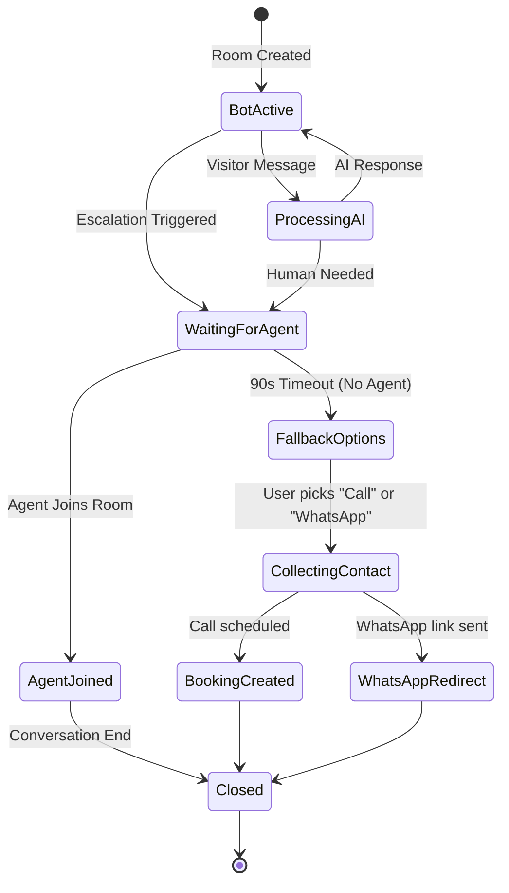
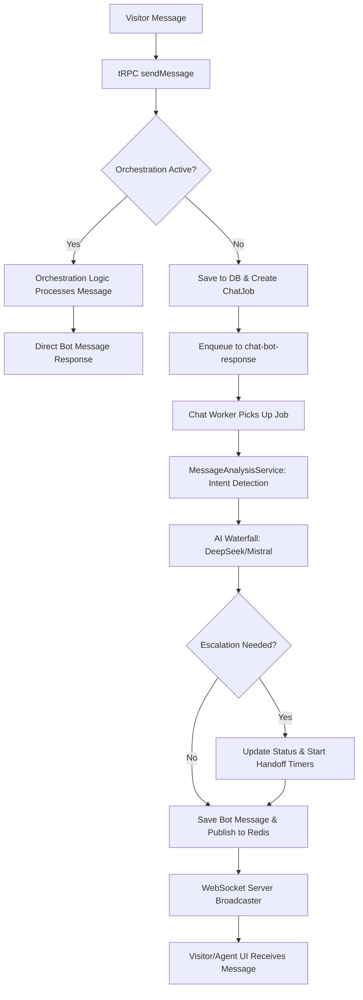

# Alpadev AI Chatbot Technical Guide

This document provides a technical overview of the chatbot system within the Alpadev AI monorepo. It is designed to onboard new developers and explain the architecture, data flow, and key components of the real-time AI-powered chat experience.

---

## 1) Overview: What is the chatbot in this project?

The Alpadev AI chatbot is an integrated live chat solution that combines real-time messaging, asynchronous AI processing, and human agent escalation.

*   **Purpose:** To provide instant support and sales assistance to website visitors, qualify leads, and seamlessly hand off complex inquiries to human agents.
*   **Primary Users:**
    *   **Visitors:** Interact via the `ChatWidget` on the frontend.
    *   **Agents/Admins:** Manage conversations and intervene via the Agent Dashboard (`/dashboard/chat`).
*   **Main Goals:**
    *   **Automated Support:** Resolve common queries using AI models.
    *   **Lead Generation:** Collect visitor contact information during fallback flows.
    *   **Scheduling:** Enable automated meeting booking via Google Calendar.
    *   **WhatsApp Handoff:** Provide a quick transition to WhatsApp for mobile or long-term communication.
*   **Key Components:**
    *   **WebSocket Server:** Custom implementation in `apps/frontend/server.ts` for real-time delivery.
    *   **AI Orchestrator:** Manages the "waterfall" strategy across multiple LLMs (DeepSeek, Mistral).
    *   **Queue System:** Built with BullMQ and Redis to handle AI processing and handoff timers asynchronously.
    *   **Orchestration Service:** A state machine that manages conversation phases (bot active, waiting for human, fallback, etc.).

---

## 2) End-to-end: How it works step by step

### User Journey: First Message to Resolution

1.  **Initiation:** A visitor opens the `ChatWidget`. The frontend calls `chat.createRoom`, which creates a new `ChatRoom` in MongoDB (status: `bot_active`).
2.  **Message Sending:** The visitor sends a message via tRPC `chat.sendMessage`. The message is saved to the database and emitted as a `message.new` event.
3.  **Processing Decision:**
    *   If the conversation is in a stateful flow (e.g., collecting an email), the `OrchestrationService` handles it directly.
    *   Otherwise, a `ChatJob` is created and added to the `chat-bot-response` queue.
4.  **AI Generation:** The `Chat Worker` picks up the job, analyzes intent, and queries the AI waterfall. The response is saved as a `bot` message.
5.  **Real-time Delivery:** The bot message is published to the Redis `chat:events` channel. The WebSocket server (subscribed to this channel) broadcasts the message to the visitor's socket.
6.  **Escalation (if needed):** If the AI detects a need for a human or keywords match escalation patterns, the room status changes to `waiting_for_agent`.
7.  **Resolution:** The conversation ends either when the user is satisfied by the bot, an agent joins and resolves the issue, or a fallback (booking/WhatsApp) is completed.

---

## 3) Core process flow (high-level)

The following diagram illustrates the high-level states and transitions of a chat room.



**Key Decision Points:**
*   **Intent Detection:** Determined by `MessageAnalysisService` (keyword/regex) and AI action flags.
*   **Escalation:** Triggered if `actionType === 'escalate_to_human'` or specific keywords are found.
*   **Handoff Timeout:** 90-second window for agents to join before fallback options are presented.

---

## 4) Queue system: How queues work in this project

Queues are used to decouple the frontend request-response cycle from slow or unreliable operations like AI generation and timed reminders.

### Queue Types
1.  **`chat-bot-response`**: Handles asynchronous AI message generation.
    *   **Producer:** `ChatService.sendMessage` (via `enqueueBotResponse`).
    *   **Consumer:** `chat.worker.ts`.
2.  **`handoff-timers`**: Manages the 30s reminder and 90s timeout for human handoff.
    *   **Producer:** `OrchestrationService.startHandoffTimers`.
    *   **Consumer:** `handoff.worker.ts`.

### Reliability and Schemas
*   **Retry Strategy:** `chat-bot-response` uses exponential backoff (3 attempts). `handoff-timers` uses 1 attempt (time-sensitive).
*   **DLQ:** Currently, failed jobs are marked as `failed` in the `ChatJob` collection but do not have a separate Dead Letter Queue for re-processing.
*   **Message Schema (Job Data):**
    ```json
    {
      "jobId": "ObjectID",
      "roomId": "ObjectID",
      "visitorMessage": "String content"
    }
    ```

---

## 5) WebSocket: How the WebSocket layer works

The WebSocket layer provides the "live" feel by pushing events to both visitors and agents.

*   **Connection Lifecycle:**
    *   **Connect:** Client opens connection to `${origin}/ws`.
    *   **Auth/Subscribe:** Visitors send a `subscribe` message with `roomId` and `visitorId`. Agents send `subscribe.agent`.
    *   **Heartbeat:** `ping`/`pong` events keep the connection alive.
    *   **Disconnect:** On close, the frontend `useWebSocket` hook initiates exponential backoff reconnection.
*   **Event Types:**
    *   `message.new`: New message (bot, visitor, or agent).
    *   `room.statusChange`: e.g., `bot_active` -> `waiting_for_agent`.
    *   `handoff.timeout`: Triggers fallback buttons in the UI.
    *   `booking.created`: Confirmation of a scheduled meeting.
*   **Error Handling:** Malformed messages are ignored. Connection drops trigger the client-side retry logic.

---

## 6) WebSocket + AI: How they work together

The AI does not run directly on the WebSocket server; instead, they communicate through a Redis-backed event bus.

1.  **Routing:** `User -> WebSocket -> tRPC -> ChatService -> BullMQ -> Worker -> AI -> Redis -> WebSocket -> User`.
2.  **AI Execution:** The AI runs in the `Chat Worker` process. It uses a **Waterfall Strategy** (DeepSeek V2.5 -> Mistral 7B -> Mistral Nemo) to ensure a response is generated even if one provider fails.
3.  **Tool Calls / Actions:** The AI returns structured JSON. If the action is `schedule_meeting`, the worker saves this intent, and the `OrchestrationService` takes over to collect dates/times via follow-up messages. The final result (Meet link) is pushed as a `booking.created` event.

---

## 7) Queue process flow (detailed)

This diagram focuses on the message ingestion and processing pipeline.



---

## 8) Detailed service inventory

| Name | Responsibility | Inputs/Outputs | Dependencies | Config/Env |
| :--- | :--- | :--- | :--- | :--- |
| `ChatService` | Main entry point for chat logic & event bus. | Msg Data -> Room/Msg Records | `ChatRepository`, Redis | Redis Pub/Sub Channel |
| `OrchestrationService` | Manages state machine & fallback flows. | Visitor Msg -> Bot Response | `handoffQueue`, `BookingService` | WhatsApp Hardcoded # |
| `AIChatService` | Orchestrates LLM waterfall & validation. | Prompt -> JSON AI Response | `DeepSeek`, `Mistral` | AI API Keys |
| `MessageAnalysisService` | Keyword-based intent classification. | Raw Text -> Intent/Confidence | None | Regex patterns |
| `WebSocket Server` | Manages active socket connections. | WS Messages -> Redis Pub | `ws`, `ChatService` | Port 3000 /ws |
| `BookingService` | Creates Google Calendar events. | Booking Data -> Meet Link | `Google API`, `Resend` | Google OAuth Creds |
| `Chat Worker` | Consumes BullMQ jobs for AI generation. | Job Data -> Bot Message | `AIChatService`, `ChatRepository` | Concurrency: 3 |
| `Handoff Worker` | Processes handoff reminders & timeouts. | Timer Job -> Status Change | `OrchestrationService` | Concurrency: 5 |

---

## 9) Improvement opportunities (analysis)

*   **Bottlenecks:** AI generation is the slowest part of the path. While asynchronous, it can lead to "waiting for response" states in the UI.
*   **Security:** WebSocket agent subscription (`subscribe.agent`) currently lacks server-side session/role verification, relying on client-side trust.
*   **PII Handling:** Visitor emails and phone numbers are stored in plain text in MongoDB. A masking/redaction policy should be implemented for logs.
*   **Observability:** Implement structured logging (JSON) and trace IDs that correlate a visitor message to its specific `ChatJob` and the resulting AI response.
*   **Scalability:** The custom WebSocket server in `server.ts` is not currently configured for multi-node horizontal scaling (sticky sessions or a shared socket state would be needed).
*   **Quick Wins:**
    1.  Add a `worker:all` script to run both workers easily.
    2.  Implement a basic DLQ for failed `ChatJobs`.
    3.  Add server-side auth check for WebSocket agent subscriptions.

---

### Assumptions
*   The system assumes Redis is always available as the message broker and job store.
*   The "Waterfall" strategy assumes that at least one AI provider (DeepSeek/Mistral) is operational.
*   Agents are expected to be monitoring the dashboard during business hours to fulfill the "Human Handoff" promise.

### Questions / Missing Info
*   Is there a planned integration for Twilio WhatsApp Webhooks to handle replies *outside* the website widget?
*   Should the system support multi-tenant bot configurations in the future?
*   What is the desired data retention policy for chat transcripts and collected visitor PII?
